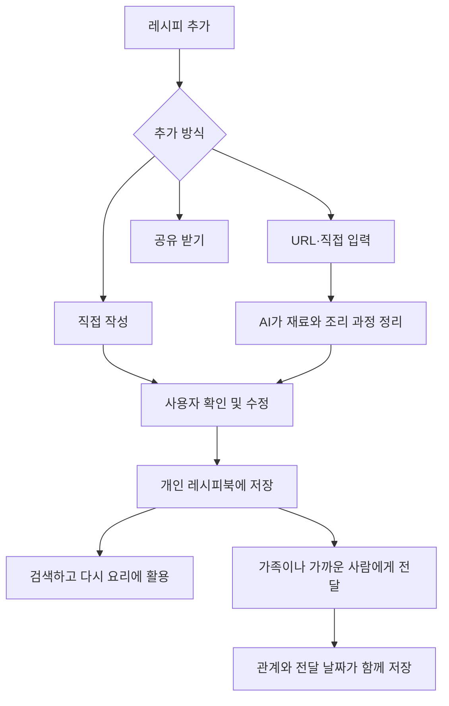

# 나만의 레시피북 서비스
직접 알고 있는 레시피와 인터넷에서 발견한 레시피를 한곳에 모으고, AI가 실제로 다시 요리하기 좋은 형태로 정리해 주는 개인 레시피북 서비스입니다.

## 문제 정의
사람들은 자신이 알고 있는 요리법, 인터넷에서 발견한 레시피, 가족에게 전해 들은 레시피를 여러 장소에 흩어진 형태로 보관합니다. 이러한 방식은 다시 찾아 활용하기 어렵고, 영상이나 자유로운 문장으로 남아 있는 요리법은 실제 조리에 사용하기 좋은 형태로 정리하기도 번거롭습니다. 

특히 부모님이나 할머니에게 전해 받은 마더 레시피는 단순한 조리 정보가 아니라 사람과 기억이 담긴 기록이지만, 일반적인 메모나 링크 공유 방식에서는 누가 전해준 레시피인지에 대한 연결과 의미가 쉽게 사라집니다.

## 핵심 기능
1. 레시피 수집 및 정리
2. 관계 중심 레시피 공유

## 기술 스택

* Frontend: React, Tailwind CSS, React Router (`react-router`)
* Backend: Express, PostgreSQL
* Authentication: Firebase Authentication
* AI: OpenAI Responses API, GPT-5.6 Luna (`gpt-5.6-luna`)

## 인증

Firebase Authentication을 사용한다. 초기 MVP에서는 Google 로그인만 제공하고, 핵심 레시피 흐름이 완성된 뒤 이메일/비밀번호와 카카오 로그인을 추가한다. Firebase는 인증에만 사용하며, 사용자와 레시피 데이터는 Express와 PostgreSQL에서 관리한다.

## 핵심 서비스 흐름


## 로컬 실행

### 사전 요구 사항

* Node.js `^20.19.0` 또는 `>=22.12.0`
* Firebase 프로젝트에서 Google 로그인 제공자를 활성화한다.
* Firebase Admin SDK용 서비스 계정 JSON 파일을 로컬의 안전한 경로에 보관한다.

### 의존성 설치

각 앱 디렉터리에서 lockfile 기준으로 의존성을 설치한다.

```bash
cd frontend
npm ci

cd ../backend
npm ci
```

### 환경 변수

환경 변수 파일은 Git에 포함하지 않는다. 현재 `.gitignore`는 `backend/.env`와 `frontend/.env.local`을 제외한다.

프론트엔드에는 `frontend/.env.local`을 만들고 Firebase Web App 설정값을 넣는다.

```dotenv
VITE_FIREBASE_API_KEY=your_firebase_web_api_key
VITE_FIREBASE_AUTH_DOMAIN=your-project.firebaseapp.com
VITE_FIREBASE_PROJECT_ID=your-project-id
VITE_FIREBASE_STORAGE_BUCKET=your-project.firebasestorage.app
VITE_FIREBASE_MESSAGING_SENDER_ID=your-messaging-sender-id
VITE_FIREBASE_APP_ID=your-firebase-app-id

# 로컬에서는 비워 두거나 생략한다. 배포 시에는 백엔드 origin을 지정한다.
VITE_API_BASE_URL=
```

`VITE_*` 값은 브라우저에 제공된다. 서비스 계정 JSON이나 Firebase Admin 비밀값은 프론트엔드 환경 변수에 넣지 않는다.

백엔드에는 `backend/.env`를 만들고 Firebase Admin Application Default Credentials 경로를 설정한다.

```dotenv
URL_FETCH_TIMEOUT_MS=10000
URL_FETCH_MAX_REDIRECTS=3
URL_FETCH_MAX_RESPONSE_BYTES=1048576
URL_FETCH_MAX_TEXT_LENGTH=20000
FIREBASE_PROJECT_ID=your-project-id
GOOGLE_APPLICATION_CREDENTIALS=C:/absolute/path/to/firebase-admin-service-account.json
OPENAI_API_KEY=your_openai_api_key
OPENAI_MODEL=gpt-5.6-luna
YOUTUBE_DATA_API_KEY=your_youtube_data_api_key
GEMINI_API_KEY=your_gemini_api_key
GEMINI_MODEL=gemini-3.6-flash
TRANSFER_INVITATION_CODE_SECRET=replace_with_at_least_32_random_characters
PORT=3000
# 로컬 프론트엔드 또는 배포 프론트엔드의 정확한 Origin 하나를 설정한다.
CORS_ALLOWED_ORIGIN=http://localhost:5173
```

`GOOGLE_APPLICATION_CREDENTIALS`가 가리키는 서비스 계정 JSON은 저장소 밖에 보관하고 Commit하지 않는다.
`CORS_ALLOWED_ORIGIN`을 설정하면 해당 Origin의 브라우저 요청만 교차 출처로 허용한다. 로컬 Vite proxy만 사용할 때는 생략할 수 있으며, 배포 환경에서는 실제 프론트엔드 Origin으로 설정한다.
`OPENAI_API_KEY`, `YOUTUBE_DATA_API_KEY`, `GEMINI_API_KEY`, `TRANSFER_INVITATION_CODE_SECRET`은 백엔드에서만 사용하고 프론트엔드 환경 변수나 로그에 노출하지 않는다. 전달 초대 코드는 32자 이상의 `TRANSFER_INVITATION_CODE_SECRET`을 사용한 HMAC-SHA-256 해시로만 저장한다. YouTube 영상 분석은 `GEMINI_MODEL=gemini-3.6-flash`를 사용한다.
URL 수집은 DNS 조회와 각 HTTP 요청에 각각 10초 Timeout을 적용하고 Redirect는 최대 3회까지 허용한다. 각 Redirect 목적지는 동일한 URL·IP 규칙으로 다시 검증한다. 응답은 최대 1,048,576바이트, AI에 전달하는 추출 본문은 최대 20,000자로 제한하며 이 값들은 `URL_FETCH_*` 환경 변수로 조정할 수 있다.
공개 `youtube.com`, `youtu.be` 영상과 YouTube Shorts의 제목·채널명은 YouTube Data API로 조회하고, 공개 또는 자동 생성 자막을 우선 구조화 입력으로 사용한다. 자막 조회가 실패하면 Gemini 영상 분석을 한 번 사용한다. Python 3.8 이상과 `pip install -r backend/requirements.txt`가 필요하다. `youtube-transcript-api`의 프록시·쿠키·계정 인증·차단 우회는 사용하지 않으며, 영상·자막·썸네일은 저장하거나 로그에 남기지 않는다. 모든 YouTube 처리 실패는 기존 `URL_FETCH_FAILED` 422 응답과 직접 입력 안내를 사용한다.

### AI 운영 기준

MVP는 OpenAI Responses API와 `gpt-5.6-luna`를 사용한다. 2026-07-22 기준 공식 가격은 입력 100만 토큰당 1달러, 출력 100만 토큰당 6달러이며, 구조화 출력을 지원해 레시피 초안 스키마를 요청 단계에서 제한할 수 있다. 자세한 사양과 변경된 가격은 [GPT-5.6 Luna 공식 문서](https://developers.openai.com/api/docs/models/gpt-5.6-luna)에서 확인한다.

OpenAI 요청은 15초, Gemini 영상 분석 요청은 30초 후 중단하며 자동으로 재시도하지 않는다. warning 참조 무결성 개선 후 benchmark guardrail을 통과한 OpenAI `reasoning.effort: "none"`을 명시한다. 직접 입력은 공백 제거 후 최대 20,000자, 인증된 사용자별 구조화 요청은 10분에 10회로 제한한다. Timeout이나 제공자 장애가 발생하면 입력을 유지한 채 재시도할 수 있는 오류를 반환한다.

요청에는 Responses API의 `store: false`를 사용해 응답을 애플리케이션 상태로 보관하지 않는다. 이는 OpenAI의 별도 abuse monitoring 보존 정책까지 제거한다는 의미는 아니므로 운영 전 [공식 데이터 정책](https://developers.openai.com/api/docs/guides/your-data)을 다시 확인한다.

AI 결과에는 `RecipeDraft`와 `RecipeWarning`의 엄격한 JSON Schema를 적용한다. 백엔드는 구조화된 결과도 다시 검증하며, 서버 전용 필드나 사용자가 제출하지 않은 출처 URL을 거부한다. 모호한 값은 `warnings`로 표시하고, 검증 실패는 `AI_RESPONSE_INVALID`로 처리한다. 검증된 결과도 자동 저장하지 않으며 사용자가 수정한 뒤 저장 API에서 전체 규칙을 다시 검증한다.

### 개발 서버 실행

터미널 두 개에서 다음 명령을 실행한다.

```bash
# 터미널 1
cd backend
npm run dev

# 터미널 2
cd frontend
npm run dev
```

프론트엔드는 기본적으로 `http://localhost:5173`, 백엔드는 `http://localhost:3000`에서 실행된다. 로컬 프론트엔드는 Vite proxy를 통해 `/api` 요청을 백엔드로 전달하므로 `VITE_API_BASE_URL`을 설정할 필요가 없다.

### 검증 명령

```bash
cd frontend
npm run lint
npm run build

cd ../backend
npm test
npm run type-check
npm run build
```

### 측정 명령

AI benchmark는 저장소의 20개 인공 fixture를 기존 구조화 Service로 순차 실행한다. 실제 OpenAI 호출이므로 `OPENAI_API_KEY`가 필요하며 실행마다 결과와 요약을 `benchmarks/recipe-structure/results`에 남긴다.

```bash
cd backend
npm run benchmark:recipe
npm run analytics:summary
```

`analytics:summary`는 migration이 적용된 PostgreSQL에서 Event count, input type별 구조화 요청 수와 순서가 확인된 session Funnel을 출력한다. 테스트 실행 데이터는 실제 사용자 Product Metric으로 해석하지 않는다.
